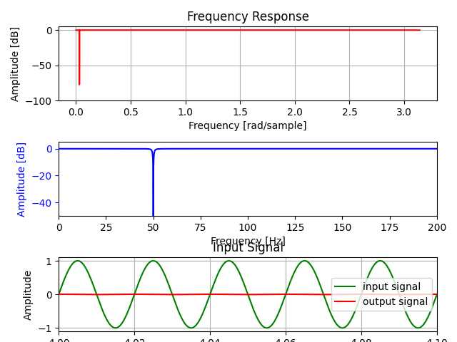
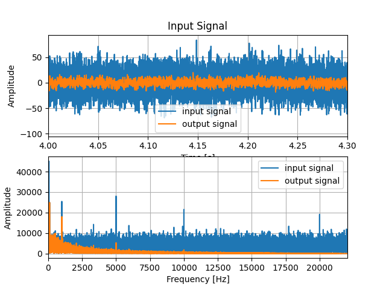

# プログラムコードファイル説明
| ファイル名 | 内容 |
| :--- | :---|
| design_IIR.py | フィルタを設計するもの.(係数出力など.)| 
| Implementation_IIR.py | design_IIR.pyでの計算結果を用いてフィルタを実装するもの.(係数をいちいち計算しなくていいから実装向き.)| 

<br>

# 使い方
まず, design_IIR.pyを実行する. <br>
実行例は以下の通りである. ここで出力されるa,bの値が係数である.
表示される図は一番上から, 横軸がrad/sampleの周波数特性のプロット, 横軸がHzの周波数特性のプロット, テスト信号(input)とフィルタリング後の信号(output)の比較グラフ(時間範囲は4.0〜4.1s)である. <br>
時間範囲は4.0〜4.1sとしている理由としては, 過去信号を用いて計算しているので最初の方はうまくフィルタリングが機能していないからである. 実際に時間軸を0〜に設定してみて貰えばその様になっていることが確認できる.<br>
以下のグラフより, 50HzでBSFが動作していることがわかる.<br>

```
> python design_IIR.py
サンプリングレートを入力: 10000
フィルタの種類(LPF, HPF, BPF, BSF)を入力: BSF
カットオフ周波数下限fc1を入力: 49.5
カットオフ周波数下限fc2を入力: 50.5
テスト用正弦波の周波数: 50
a: [1.0, -1.998385408066454, 0.9993718787787191]
b: [0.9996859393893595, -1.998385408066454, 0.9996859393893595]
```

<div align="center">



</div>
<br>

Implementation_IIR.pyは主に実装向けである. 先ほど求めたa, b値とサンプリングレートをコード上に書く. サンプリングレートは計算で指定した値と同値にすること.<br>
iir()関数に信号を渡すことでフィルタリングされた信号が出力される.なので, BPFの後にBSFみたいに複数のフィルタを掛けることが簡単にできる.以下の例では, BPFの後にBSFを掛けている. ここのコードを変更すれば様々な組み合わせのフィルタリングができる.

```
y = iir(x, BPF_a, BPF_b) # バンドパスフィルタ
y = iir(y, BSF_50hz_a, BSF_50hz_b) # バンドストップフィルタ
```

実行例を以下に示す. 表示される図は一番上から, 入力信号(ホワイトノイズなどの合成波), フィルタリング後の信号(output)の比較グラフ(時間範囲は4.0〜4.1s), 入力信号とフィルタリング後の信号のFFT比較グラフである(時間範囲は4.0〜4.1s).
<br>


<div align="center">



</div>
<br>


# IIRフィルタの設計

以下は自分用にメモ(非公開)したものであるので, 参考サイトの文章のままである部分が多数存在します。間違えもあるかもしれません。すいません！

### ・IIRフィルタの定義式

$$ y(n) = \sum_{i=0}^{P} b(i) \times (n-i) - \sum_{j=0}^{Q} a(j) \times y(n-j) $$

入力信号: x(n)<br>
出力信号: y(n)<br>


### ・IIRフィルタの伝達関数

$$ H(z) = \frac{B(z)}{1 + A(z)}\ $$

伝達関数: システムの入出力の関係をラプラス変換領域で表した関数<br>


### ・IIRフィルタの設計
設計手法は双一次変換を用いる.<br>
バターワースフィルタを採用した. バターワースフィルタとは, フィルタ回路設計の一種で, 通過帯域が数学的に可能な限り平坦な周波数特性となるよう設計される.<br>
今回は, 二次のバターワースフィルタで設計する. ちなみに, 次数を増やすほどQ値が大きくなり理想特性に近くなる. 多次元のバターワース特性は, [次元別バターワース特性](#・次元別バターワース特性)に示す.

### ・二次のバターワースフィルタ（バターワース特性）
$$ H_2(s) = \frac{1}{s^2 + \sqrt{2} \times s + 1 }\ $$

この式より各フィルタ(LPF, HPF, BPF, BSF)を作るには変数sを次のように置き換える.<br>

#### ・ローパスフィルタ(LPF)
$$ s→\frac{s}{2 \pi f_c } $$
#### ・ハイパスフィルタ(HPF)
$$ s→\frac{2 \pi f_c }{s} $$
#### ・バンドパスフィルタ(BPF)
$$ s→\frac{s^2+4\pi^2f_{c1}f_{c2}}{2 \pi (f_{c2} - f_{c1})s} $$
#### ・バンドストップフィルタ(BSF)
$$ s→\frac{2 \pi (f_{c2} - f_{c1})s}{s^2+4\pi^2f_{c1}f_{c2}} $$

<br>
これでアナログフィルタが完成. <br>
次にこれをデジタルフィルタに変換するために, 変数sをデジタルフィルタの変数zに置き換える.

$$ s→\frac{1-z^{-1}}{1+z^{-1}} $$

上の式の周波数fはアナログフィルタの周波数であることに注意する必要がある. <br>
フィルタに周波数を指定するときは下の式でアナログフィルタの周波数に変換する必要がある.
$$f_a →\frac{1}{2\pi}tan(\frac{\pi f_d}{f_s})$$
アナログフィルタの周波数: f_a<br>
デジタルフィルタの周波数: f_d<br>

これでデジタルフィルタの計算をする準備が整ったので, ひたすら計算をするとローパスフィルタの伝達関数は次式になる.
<br>


### ・デジタルのローパスフィルタの伝達関数
$$ H(z) = \frac{b(0)+b(1)z^{-1}+b(2)z^{-2}}{1+a(1)z^{-1}+a(2)z^{-2}} $$

ここでフィルタ係数は以下の通りとなる.
$$b(0) = b(2) = \frac{ 4\pi ^2 f_c^2 }{a+2 \sqrt{2} \pi f_c + 4\pi ^2 f_c^2}$$
$$b(1) = \frac{8\pi ^2 f_c^2 }{a+2 \sqrt{2} \pi f_c + 4\pi ^2 f_c^2}$$
$$a(1) = \frac{8\pi ^2 f_c^2 - 2 }{a+2 \sqrt{2} \pi f_c + 4\pi ^2 f_c^2}$$
$$a(2) = \frac{a+2 \sqrt{2} \pi f_c - 4\pi ^2 f_c^2}{a+2 \sqrt{2} \pi f_c + 4\pi ^2 f_c^2}$$

<br>

### ・次元別バターワース特性

<div align="center">

| n | バターワース特性 |
| :--- | :---: |
| 1 | $\frac{1}{s}$ |
| 2 | $\frac{1}{\displaystyle s^{2}+1.4142s+1}$ |
| 3 | $\frac{1}{\displaystyle (s+1)(s^{2}+s+1)}$ |
| 4 | $\frac{1}{\displaystyle (s^{2}+0.7654s+1)(s^{2}+1.8478s+1)}$ |
| 5 | $\frac{1}{\displaystyle (s+1)(s^{2}+0.6180s+1)(s^{2}+1.6180s+1)}$ |
| 6 | $\frac{1}{\displaystyle (s^{2}+0.5176s+1)(s^{2}+1.4142s+1)(s^{2}+1.9319s+1)}$ |
| 7 | $\frac{1}{\displaystyle (s+1)(s^{2}+0.4450s+1)(s^{2}+1.2470s+1)(s^{2}+1.8019s+1)}$ |
| 8 | $\frac{1}{\displaystyle (s^{2}+0.3902s+1)(s^{2}+1.1111s+1)(s^{2}+1.6629s+1)(s^{2}+1.9616s+1)}$ |

</div>


<br>

## 参考にしたサイト
・[人工知能に関する断創録 - IIRフィルタ](https://aidiary.hatenablog.com/entry/20120103/1325594723)
<br>
・[ウィキディア - バターワースフィルタ](https://ja.wikipedia.org/wiki/%E3%83%90%E3%82%BF%E3%83%BC%E3%83%AF%E3%83%BC%E3%82%B9%E3%83%95%E3%82%A3%E3%83%AB%E3%82%BF)
<br>
・[scipy.signal.freqz相当の処理を自分で書く](https://wrist.hatenablog.com/entry/2015/01/21/005834)